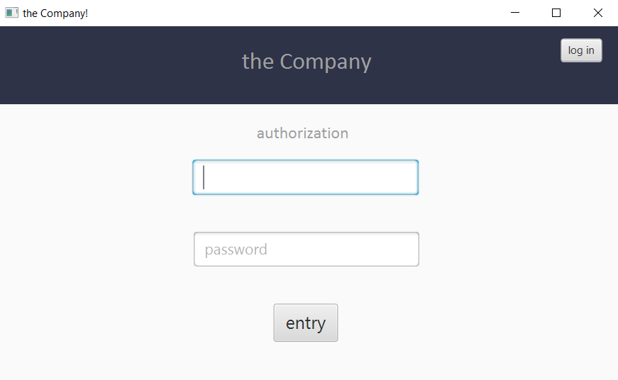
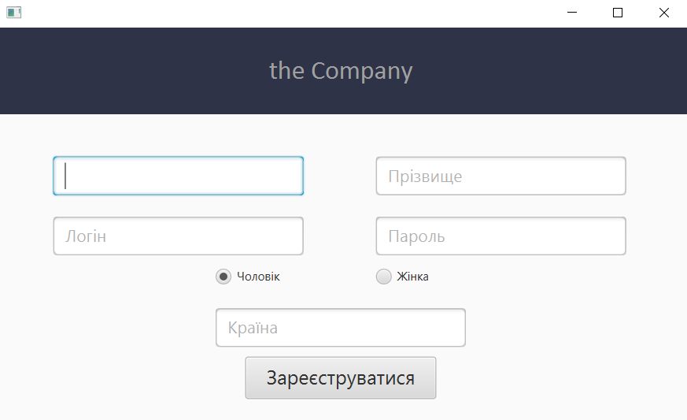
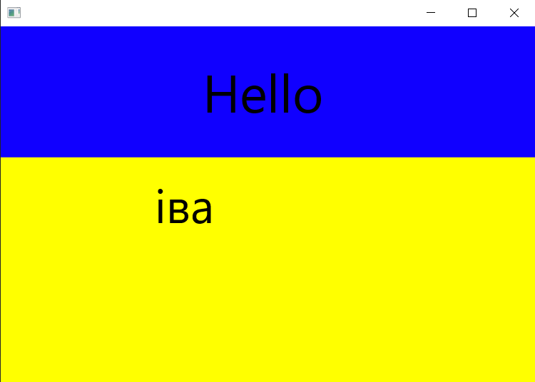

<h1>Registration_Window</h1> 
<h2>
Description.
</h2>
This programme was created for educational purposes.The programme creates a registration window with a login and password or the ability to register with fields: First name, Last name, Login, Password, Gender, Sex, Country. After entering the login and password, a welcome window appears. Users are saved to the mySQL database via the jdbc API passwords are hashed.  
Initial screen:
Registration:
Welcome screen:
